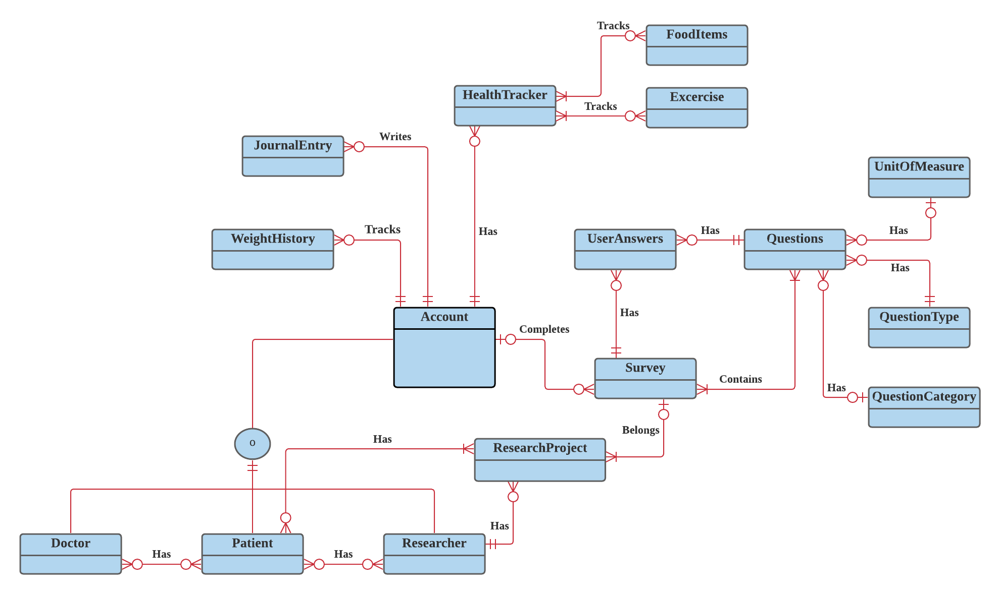
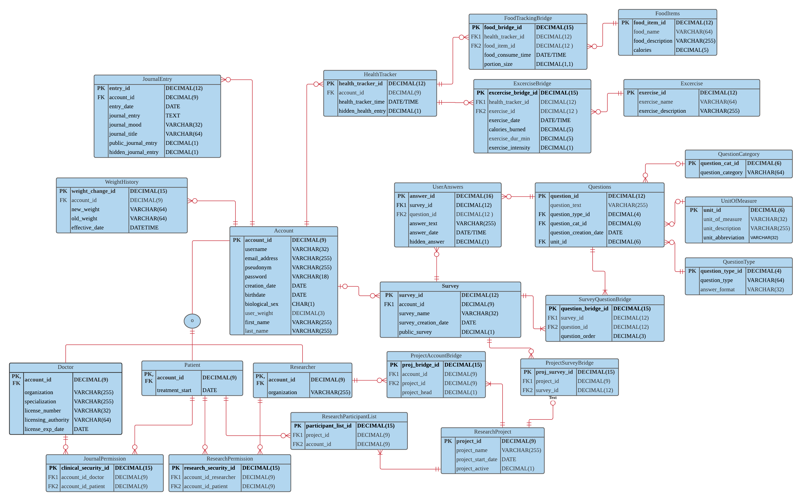

```{r setup, include=FALSE}
knitr::opts_chunk$set(echo = TRUE)
```

This page highlights a database that I built in MS SQL Server to house a health and wellness database that patients can use to store custom built survey's and that doctors can use to do research or to gain insight into their current patient's health. 

Tools used: MS SQL Server, LucidApp

### Structural Database Rules and Business Rules
```{r Database-rules, eval=FALSE}
Database Rules:


1.	An account is one or more of three types: Doctor, Researcher, or Patient.

 I decided that one of my target markets will be mental health doctors and their patients. To assist with this, I created account sub-types. Doctor’s will be able to read journals, trackers, and surveys of any account that they are assigned to on the JournalPermission table. I also created the researcher sub-type. Researchers will be able to access large amounts of survey and journal data. Patients are similar to the standard account, but contain a treatment start date and have a relationship that gives doctors and researchers permission to view their journal entries and/or other health and wellness information. 

2.	Every Account can author multiple Journal entries; every Journal Entry is authored by one Account. 

Each account (contingent on account type) can write multiple journal entries. Each journal entry must be associated with an account, and only one account can be the author of each entry.

3.	Each Account can complete multiple Surveys; each Survey can be completed by one Account.

This is straightforward. An account can complete many surveys over time, but each survey instance can only be associated with one account, on the physical ERD this is broken up into multiple tables since the answers to surveys are saved in the UserAnswers entity. 


4.	Each survey contains survey questions; each question may be contained in multiple surveys.

Each template will be associated with questions saved in the Questions entity. 

5.	Each survey question may have many answers; each answer must have only one survey question.

Answers will be saved in the SurveyAnswer table and will be associated with a particular survey instance, as well as an individual survey question (see RULE 8). 


6.	Each survey saves survey answers; each survey answer is associated with a survey.

Answers will be saved in the SurveyAnswer table and will be associated with a particular survey instance, as well as an individual survey question.

7.	Each Question has one Question Type; each Question Type might be associated with many questions.

Each question will have a type such as “free form”, “Likert Scale (1-7)”, “Likert Scale (1 -5 ), etc. These types will assist with storing answers correctly, and also with the UX design for the website. 

8.	Each Question could have one unit of measure; each Unit of Measure could be associated with multiple Questions. 

Each question will have a unit of measure so that during analysis the integrity of data can be ensured. Knowing the units (eg pounds vs kilograms) will allow researchers to easily convert data for uniformity. 

9.	Each Question can have 1 Question Category; each Question category may belong to multiple Questions.

Categories are for analysis and help to group questions. Categories could be “mental health”, “physical activity”, or anything else that question creator decides makes sense.

10.	Each user can record multiple entries in a food tracker; each food tracker entry is recorded by one user.

Users will enter their daily food intake into the food tracker. Each entry will be associated with a user. 

11.	Each health tracker entry can have multiple food items; each food item can be included in multiple food tracker entries.

The food tracker food items will be saved into a food items table so that food items can be searched and selected when the user completes tracker.

12.	Each health tracker entry can have multiple Exercise entries; each Exercise can be included in multiple health tracker entries.

The exercise tracker activities will be saved into a exercise table so that exercises can be searched and selected when the user completes tracker.


13.	Each Researcher can be associated with multiple projects; each project may be associated with multiple researchers.

Researchers can create “projects” that are associated with different survey templates. These projects will also have many patients associated with them which will allow the researchers to gather the same dataset from many different users.

14.	Each Research Project may be associated with multiple Surveys; each Survey may be associated with multiple Research Projects. 

Survey projects can have many surveys associated with them. For instance, one project may have two different surveys that they give. One goes to a control group, the other goes to a group with different demographics. Likewise, since survey templates can be re-used, the survey template may be used in multiple projects.

15.	Each Research Project may be associated with multiple Patients; each Patient may be associated with multiple Research Projects. 

Each Project will have one to many patients that are participants. Being a participant means that the researchers will have access to the patient’s surveys, journals, and food and exercise trackers.

16.	Each Doctor may have permission for multiple Patients; each Patient may give multiple Doctors permission.

Doctor’s have multiple patients. Likewise, patients can have more than one doctor. When a relationship is present, the doctor will have access to their patient’s journal, and other health and wellness data. 

17.	Each WeightHistory record is associated with one Account; an Account may have multiple WeightHistory records.

This is where changes to Answer.weight will be recorded. 


Business Rules:

1.	Users can change their Pseudonym up to three(3) times every rolling year.

Historic pseudonyms will be tied to a user’s journal entries, so limiting the number of changes will keep the availability of popular names high, while also allowing users more than one attempt to make a change each year.

2.	Users can save survey templates for themselves or they can mark them public and they can be shared. 

Templates are a grouping of survey questions that can be used over and over. 

3.	‘Normal accounts and Patient account types can have from 1 to 15 questions on their survey templates.

4.	‘Researcher’ account types can have from 1 to 30 questions on their survey templates.

5.	Normal accounts can only see their own survey answers.

Answers to survey questions are stored so that users can easily access the data at a later date, but the data is only available for the answers that each user gives.

6.	Researchers can see survey responses from any user that is a participant on a project they belong to. 


7.	Users can see any journal entry marked “Public”.

Users can search through and read public journal entries.

8.	“Doctor” account types can see journals and survey data from any of their patients, unless it is marked “hidden” by the patient. 

9.	Only Researchers can participate in Research Projects. 

Since account sub-types are overlap, Doctor’s can create a researcher account to participate in projects.


```


### Entity-Relationship-Diagram
Here is the ERD for my database. I used crow's-foot, but I've since come to prefer UML notation. 

```{r ERD, echo=FALSE, fig.align='left', out.width="100%", fig.height=70, fig.link="images/Conceptual.jpg"}

```

### Physical ERD
Here is the full physical ERD for the DBMS. The database has been normalized to BCNF. 

```{r Physical-ERD,  echo=FALSE, fig.align='left', fig.height=100, fig.link="images/DBMS Physical.jpg"}

```

# SQL
I've included my code for database creation. 

### Table Creation
```{r table-creation, eval=FALSE}
-- TABLES

--This is the account table, the "heart" of the ERD.
CREATE TABLE Account(account_id DECIMAL(9) NOT NULL PRIMARY KEY 
					,username VARCHAR(32) NOT NULL
					,pseudonym VARCHAR(64) NOT NULL
					,email_address VARCHAR(255) NOT NULL
					,password VARCHAR(18) NOT NULL
					,creation_date DATE
					,birthdate DATE NOT NULL
					,biological_sex char(1) NOT NULL
					,user_weight DECIMAL(3) NOT NULL
					,first_name VARCHAR(255) NOT NULL
					,last_name VARCHAR(255) NOT NULL
					,CONSTRAINT AK_username UNIQUE (username) -- username must be unique.
					,CONSTRAINT AK_pseudonym UNIQUE (pseudonym) -- pseudonym must be unique.
					);

CREATE TABLE WeightHistory (weight_change_id DECIMAL(15) NOT NULL PRIMARY KEY
							 ,old_weight DECIMAL(3) NOT NULL
							 ,new_weight DECIMAL(3) NOT NULL
							 ,account_id DECIMAL(9) NOT NULL
							 ,effective_date DATETIME NOT NULL
							 ,FOREIGN KEY (account_id) REFERENCES Account(account_id)
							 );


CREATE TABLE Doctor (account_id DECIMAL(9) NOT NULL PRIMARY KEY 
					,specialization VARCHAR(255)
					,license_number VARCHAR(32) NOT NULL
					,licensing_authority VARCHAR(64) NOT NULL
					,license_exp_date DATE
					,organization VARCHAR(255) 
					,FOREIGN KEY (account_id) REFERENCES Account(account_id)
					);

CREATE TABLE Patient (account_id DECIMAL(9) NOT NULL PRIMARY KEY 
					 ,treatment_start DATE
					 ,FOREIGN KEY (account_id) REFERENCES Account(account_id)
					 );

CREATE TABLE Researcher (account_id DECIMAL(9) NOT NULL PRIMARY KEY
						,FOREIGN KEY (account_id) REFERENCES Account(account_id)
						,organization VARCHAR(255) 
						);

CREATE TABLE JournalEntry (entry_id DECIMAL(12) NOT NULL PRIMARY KEY
						  ,account_id DECIMAL(9) NOT NULL
						  ,entry_date DATE DEFAULT GETDATE() --defaults to current date unless overridden in application
						  ,journal_entry TEXT NOT NULL
						  ,journal_mood VARCHAR(32)
						  ,journal_title VARCHAR(64) DEFAULT (GETDATE() + ' Entry')
						  ,public_journal_entry DECIMAL(1) NOT NULL DEFAULT 0 -- Defaults to not public.
						  ,hidden_journal_entry DECIMAL(1) NOT NULL DEFAULT 0 --  Defaults to not hidden.
						  ,FOREIGN KEY (account_id) REFERENCES Account(account_id)
						  );

CREATE TABLE HealthTracker (health_tracker_id DECIMAL(12) NOT NULL PRIMARY KEY
						 ,account_id DECIMAL(9) NOT NULL
						 ,health_tracker_time DATE NOT NULL
						 ,hidden_health_entry DECIMAL(1) NOT NULL DEFAULT 0 -- Defaults to not hidden.
						 ,FOREIGN KEY (account_id) REFERENCES Account(account_id)
						 );

CREATE TABLE FoodItems(food_item_id DECIMAL(12) NOT NULL PRIMARY KEY
					  ,food_name VARCHAR(64) NOT NULL
					  ,food_description VARCHAR(255)
					  ,calories DECIMAL(5)
					  );

CREATE TABLE ExerciseType(exercise_id DECIMAL(12) NOT NULL PRIMARY KEY
							  ,exercise_name VARCHAR(64) NOT NULL
							  ,exercise_description VARCHAR(255)
							  );

CREATE TABLE Survey (survey_id DECIMAL(12) NOT NULL PRIMARY KEY
					,account_id DECIMAL(9) NOT NULL
					,survey_name VARCHAR(32) NOT NULL
					,survey_creation_date DATE NOT NULL
					,public_survey DECIMAL(1) NOT NULL DEFAULT 0 -- Defaults to not public.
					,FOREIGN KEY (account_id) REFERENCES Account(account_id)
					);

CREATE TABLE UnitOfMeasure (unit_id DECIMAL(6) NOT NULL PRIMARY KEY
						   ,unit_of_measure VARCHAR(32) NOT NULL
						   ,unit_description VARCHAR(255)
						   ,unit_abbreviation VARCHAR(32)
						   );

CREATE TABLE QuestionType (question_type_id DECIMAL(4) NOT NULL PRIMARY KEY
						  ,question_type VARCHAR(64)
						  ,answer_format VARCHAR(32)
						  );

CREATE TABLE QuestionCategory (question_cat_id DECIMAL(6) NOT NULL PRIMARY KEY
							  ,question_category VARCHAR(64)
							  );

CREATE TABLE Questions(question_id DECIMAL(12) NOT NULL PRIMARY KEY
						 ,question_text VARCHAR(255) NOT NULL
						 ,question_type_id DECIMAL(4) NOT NULL
						 ,question_cat_id DECIMAL(6)
						 ,question_creation_date DATE NOT NULL
						 ,unit_id DECIMAL(6)
						 ,FOREIGN KEY (question_type_id) REFERENCES QuestionType(question_type_id)
						 ,FOREIGN KEY (unit_id) REFERENCES UnitofMeasure(unit_id)
						 ,FOREIGN KEY (question_cat_id) REFERENCES QuestionCategory(question_cat_id)
						 );

CREATE TABLE UserAnswers (answer_id DECIMAL(16) NOT NULL PRIMARY KEY
						 ,survey_id DECIMAL(12) NOT NULL
						 ,question_id DECIMAL(12) NOT NULL
						 ,answer_text VARCHAR(255)
						 ,answer_date DATE NOT NULL
						 ,hidden_answer DECIMAL(1) NOT NULL
						 ,FOREIGN KEY (survey_id) REFERENCES Survey(survey_id)
						 ,FOREIGN KEY (question_id) REFERENCES Questions(question_id)
						 );

CREATE TABLE ResearchProject (project_id DECIMAL(9) NOT NULL PRIMARY KEY
							 ,project_name VARCHAR(255) 
							 ,project_start_date DATE NOT NULL
							 ,project_active DECIMAL(1) NOT NULL
							 );

CREATE TABLE FoodTrackingBridge (food_bridge_id DECIMAL(15) NOT NULL PRIMARY KEY
								,health_tracker_id DECIMAL(12) NOT NULL
								,food_item_id DECIMAL(12) NOT NULL
								,food_consume_time DATE NOT NULL
								,portion_size DECIMAL(2,1) DEFAULT 1.0
								,FOREIGN KEY (health_tracker_id) REFERENCES HealthTracker(health_tracker_id)
								,FOREIGN KEY (food_item_id) REFERENCES FoodItems(food_item_id)
								);

CREATE TABLE ExerciseBridge (exercise_bridge_id DECIMAL(15) NOT NULL PRIMARY KEY
								,health_tracker_id DECIMAL(12) NOT NULL
								,exercise_id DECIMAL(12) NOT NULL
								,exercise_date DATETIME NOT NULL
								,calories_burned DECIMAL(5) NOT NULL
								,exercise_dur_min DECIMAL(5) NOT NULL
								,exercise_instensity DECIMAL(1) DEFAULT 3
								,FOREIGN KEY (health_tracker_id) REFERENCES HealthTracker(health_tracker_id)
								,FOREIGN KEY (exercise_id) REFERENCES ExerciseType(exercise_id)
								);

CREATE TABLE SurveyQuestionBridge (survey_question_bridge_id DECIMAL(15) NOT NULL PRIMARY KEY
								  ,survey_id DECIMAL(12) NOT NULL
								  ,question_id DECIMAL(12) NOT NULL
								  ,question_order DECIMAL(3) NOT NULL
								  ,FOREIGN KEY (survey_id) REFERENCES Survey(survey_id)
								  ,FOREIGN KEY (question_id) REFERENCES Questions(question_id)
								  );

CREATE TABLE ProjectAccountBridge (proj_bridge_id DECIMAL(15) NOT NULL PRIMARY KEY
								  ,account_id DECIMAL(9) NOT NULL
								  ,project_id DECIMAL(9) NOT NULL
								  ,project_head DECIMAL(1) NOT NULL
								  ,FOREIGN KEY (account_id) REFERENCES Account(account_id)
								  ,FOREIGN KEY (project_id) REFERENCES ResearchProject(project_id)
								  );

CREATE TABLE ResearchParticipantList (participant_list_id DECIMAL(15) NOT NULL PRIMARY KEY
									 ,project_id DECIMAL(9) NOT NULL
									 ,account_id DECIMAL(9) NOT NULL
									 ,FOREIGN KEY (project_id) REFERENCES ResearchProject(project_id)
									 ,FOREIGN KEY (account_id) REFERENCES Account(account_id)
									 );

CREATE TABLE ProjectSurveyBridge (project_survey_id DECIMAL(15) PRIMARY KEY
								 ,project_id DECIMAL(9) NOT NULL
								 ,survey_id DECIMAL(12) NOT NULL
								 ,FOREIGN KEY (project_id) REFERENCES ResearchProject(project_id)
								 ,FOREIGN KEY (survey_id) REFERENCES Survey(survey_id)
								 );

CREATE TABLE JournalPermission (journal_security_id DECIMAL(16) NOT NULL PRIMARY KEY
							 ,account_id_doctor DECIMAL(9) NOT NULL
							 ,account_id_patient DECIMAL(9) NOT NULL
							 ,FOREIGN KEY (account_id_doctor) REFERENCES Doctor(account_id)
							 ,FOREIGN KEY (account_id_patient) REFERENCES Patient(account_id)
							 );

CREATE TABLE ResearchPermission (research_security_id DECIMAL(16) NOT NULL PRIMARY KEY
							 ,account_id_researcher DECIMAL(9) NOT NULL
							 ,account_id_patient DECIMAL(9) NOT NULL
							 ,FOREIGN KEY (account_id_researcher) REFERENCES Researcher(account_id)
							 ,FOREIGN KEY (account_id_patient) REFERENCES Account(account_id)
							 );
GO

```

### Sequencing
```{r Sequencing, eval=FALSE}
--SEQUENCES

CREATE SEQUENCE account_id_seq START WITH 1;

CREATE SEQUENCE weight_hist_seq START WITH 1;

CREATE SEQUENCE journalentry_id_seq START WITH 1;

CREATE SEQUENCE healthtracker_id_seq START WITH 1;

CREATE SEQUENCE fooditems_id_seq START WITH 1;

CREATE SEQUENCE exercise_id_seq START WITH 1;

CREATE SEQUENCE survey_id_seq START WITH 1;

CREATE SEQUENCE questions_id_seq START WITH 1;

CREATE SEQUENCE question_cat_id_seq START WITH 1;

CREATE SEQUENCE unitofmeasure_id_seq START WITH 1;

CREATE SEQUENCE questiontype_id_seq START WITH 1;

CREATE SEQUENCE useranswers_id_seq START WITH 1;

CREATE SEQUENCE researchproject_id_seq START WITH 1;

CREATE SEQUENCE exercise_bridge_id_seq START WITH 1;

CREATE SEQUENCE foodtrackingbridge_id_seq START WITH 1;

CREATE SEQUENCE surveyquestionbridge_id_seq START WITH 1;

CREATE SEQUENCE projectaccountbridge_id_seq START WITH 1;

CREATE SEQUENCE researchparticipantlist_id_seq START WITH 1;

CREATE SEQUENCE projectsurveybridge_id_seq START WITH 1;

CREATE SEQUENCE journalpermission_id_seq START WITH 1;

CREATE SEQUENCE researchpermission_id_seq START WITH 1;

GO

```


### Indexing
```{r Indexing, eval=FALSE}
--INDEXES
GO
CREATE INDEX IX_Account_birthdate 
ON Account(birthdate);

CREATE INDEX IX_JournalEntry_journal_mood 
ON JournalEntry(journal_mood);

CREATE INDEX IX_JournalEntry_entry_date 
ON JournalEntry(entry_date);

CREATE INDEX IX_JournalPermission_account_id_doctor 
ON JournalPermission(account_id_doctor);

CREATE INDEX IX_JournalPermission_account_id_patient 
ON JournalPermission(account_id_patient);

CREATE INDEX IX_Doctor_account_id 
ON Doctor(account_id);

CREATE INDEX IX_HealthTracker_account_id 
ON HealthTracker(account_id);

CREATE INDEX IX_FoodTrackingBridge_food_item_id 
ON FoodTrackingBridge(food_item_id);

CREATE INDEX IX_FoodTrackingBridge_health_tracker_id 
ON FoodTrackingBridge(health_tracker_id);

CREATE INDEX IX_ExerciseBridge_exercise_id 
ON ExerciseBridge(exercise_id);

CREATE INDEX IX_ExerciseBridge_health_tracker_id 
ON ExerciseBridge(health_tracker_id);

CREATE INDEX IX_JournalEntry_account_id 
ON JournalEntry(account_id);

CREATE INDEX IX_Patient_account_id 
ON Patient(account_id);

CREATE INDEX IX_ProjectAccountBridge_account_id 
ON ProjectAccountBridge(account_id);

CREATE INDEX IX_ProjectAccountBridge_project_id 
ON ProjectAccountBridge(project_id);

CREATE INDEX IX_ProjectSurveyBridge_project_id 
ON ProjectSurveyBridge(project_id);

CREATE INDEX IX_ProjectSurveyBridge_survey_id 
ON ProjectSurveyBridge(survey_id);

CREATE INDEX IX_Questions_question_cat_id 
ON Questions(question_cat_id);

CREATE INDEX IX_Questions_question_type_id 
ON Questions(question_type_id);

CREATE INDEX IX_Questions_unit_id 
ON Questions(unit_id);

CREATE INDEX IX_Researcher_account_id 
ON Researcher(account_id);

CREATE INDEX IX_ResearchParticipantList_project_id 
ON ResearchParticipantList(project_id);

CREATE INDEX IX_ResearchParticipantList_account_id 
ON ResearchParticipantList(account_id);

CREATE INDEX IX_ResearchPermission_account_id_researcher 
ON ResearchPermission(account_id_researcher);

CREATE INDEX IX_ResearchPermission_account_id_participant 
ON ResearchPermission(account_id_patient);

CREATE INDEX IX_Survey_account_id 
ON Survey(account_id);

CREATE INDEX IX_SurveyQuestionBridge_question_id 
ON SurveyQuestionBridge(question_id);

CREATE INDEX IX_SurveyQuestionBridge_survey_id 
ON SurveyQuestionBridge(survey_id);

CREATE INDEX IX_UserAnswers_question_id 
ON UserAnswers(question_id);

CREATE INDEX IX_UserAnswers_survey_id 
ON UserAnswers(survey_id);

CREATE INDEX IX_WeightHistory_account_id 
ON WeightHistory(account_id );

```


### Triggers
```{r Triggers, eval=FALSE}
-- HISTORY TRIGGER

GO

CREATE TRIGGER WeightChangeTrigger
ON Account
AFTER UPDATE
AS
BEGIN
	DECLARE @old_weight DECIMAL(3) = (SELECT user_weight FROM DELETED);
	DECLARE @new_weight DECIMAL(3) = (SELECT user_weight FROM INSERTED);

	IF (@old_weight != @new_weight)
		INSERT INTO WeightHistory (weight_change_id
									,old_weight
									,new_weight
									,account_id
									,effective_date)
		VALUES (NEXT VALUE FOR weight_hist_seq
				,@old_weight
				,@new_weight
				,(SELECT account_id FROM INSERTED)
				,GETDATE()
				);
END;
GO
```


### Procedures
```{r Procedures, eval=FALSE}
--STORED PROCEDURES
--Replace this with your stored procedure definitions.

-- Use Case 1: Account Creation for users.
CREATE PROCEDURE CreateAccount @username VARCHAR(32)
								,@email_address VARCHAR(255)
								,@pseudonym VARCHAR(255)
								,@password VARCHAR(18)
								,@birthdate DATE
								,@biological_sex CHAR(1)
								,@user_weight DECIMAL(3)
								,@first_name VARCHAR(255)
								,@last_name VARCHAR(255)
AS
BEGIN
	INSERT INTO Account(account_id
						,username
						,email_address
						,pseudonym
						,password
						,creation_date
						,birthdate
						,biological_sex
						,user_weight
						,first_name
						,last_name
						)
	VALUES (NEXT VALUE FOR account_id_seq
			,@username
			,@email_address
			,@pseudonym
			,@password
			,GETDATE()
			,CAST (@birthdate AS DATE)
			,@biological_sex
			,@user_weight
			,@first_name
			,@last_name);
END;
GO
-- Use Case 2: Account Creation for Doctors and Researchers.
CREATE PROCEDURE CreateDoctorAccount @username VARCHAR(32)
								,@email_address VARCHAR(255)
								,@pseudonym VARCHAR(255)
								,@password VARCHAR(18)
								,@birthdate DATE
								,@biological_sex CHAR(1)
								,@user_weight DECIMAL(3)
								,@first_name VARCHAR(255)
								,@last_name VARCHAR(255)
								,@organization VARCHAR(255)
								,@specialization VARCHAR(255)
								,@license_number VARCHAR(32)
								,@licensing_authority VARCHAR(64)
								,@license_exp_date DATE


AS
BEGIN

	INSERT INTO Account(account_id, username, email_address, pseudonym, password, creation_date, birthdate, 
						biological_sex, user_weight, first_name, last_name)
	VALUES (NEXT VALUE FOR account_id_seq, @username, @email_address, @pseudonym, @password, GETDATE(),
			CAST (@birthdate AS DATE), @biological_sex, @user_weight, @first_name, @last_name);

	INSERT INTO Doctor(account_id, organization, specialization, license_number, licensing_authority, license_exp_date) 
	VALUES(CAST((SELECT Current_Value FROM SYS.Sequences WHERE name='account_id_seq')AS DECIMAL(9)), @organization, @specialization, @license_number, @licensing_authority,
			CAST(@license_exp_date AS DATE));

END;
GO
-- Use Case 3: Creating a Journal Entry
CREATE PROCEDURE AddJournalEntry @account_id DECIMAL(9)
								,@journal_entry TEXT
								,@journal_mood VARCHAR(32)
								,@journal_title VARCHAR(64)
								,@public DECIMAL(1)
								,@hidden DECIMAL(1)

AS
BEGIN
	INSERT INTO JournalEntry(entry_id, account_id, entry_date, journal_entry, journal_mood, 
								journal_title, public_journal_entry, hidden_journal_entry)
	VALUES(NEXT VALUE FOR journalentry_id_seq, @account_id, GETDATE(), @journal_entry, @journal_mood, @journal_title,
			@public, @hidden);
END;
GO
-- Other procedures for data insertion.

-- 
CREATE PROCEDURE CreateResearcherAccount @username VARCHAR(32)
								,@email_address VARCHAR(255)
								,@pseudonym VARCHAR(255)
								,@password VARCHAR(18)
								,@birthdate DATE
								,@biological_sex CHAR(1)
								,@user_weight DECIMAL(3)
								,@first_name VARCHAR(255)
								,@last_name VARCHAR(255)
								,@organization VARCHAR(255)

AS
BEGIN

	INSERT INTO Account(account_id, username, email_address, pseudonym, password, creation_date, birthdate, 
						biological_sex, user_weight, first_name, last_name)
	VALUES (NEXT VALUE FOR account_id_seq, @username, @email_address, @pseudonym, @password, GETDATE(),
			CAST (@birthdate AS DATE), @biological_sex, @user_weight, @first_name, @last_name);

	INSERT INTO Researcher(account_id, organization) 
	VALUES(CAST((SELECT Current_Value FROM SYS.Sequences WHERE name='account_id_seq')AS DECIMAL(9)), @organization);

END;
GO

CREATE PROCEDURE CreatePatient @username VARCHAR(32)
								,@email_address VARCHAR(255)
								,@pseudonym VARCHAR(255)
								,@password VARCHAR(18)
								,@birthdate DATE
								,@biological_sex CHAR(1)
								,@user_weight DECIMAL(3)
								,@first_name VARCHAR(255)
								,@last_name VARCHAR(255)
AS
BEGIN

	INSERT INTO Account(account_id, username, email_address, pseudonym, password, creation_date, birthdate, 
						biological_sex, user_weight, first_name, last_name)
	VALUES (NEXT VALUE FOR account_id_seq, @username, @email_address, @pseudonym, @password, GETDATE(),
			CAST (@birthdate AS DATE), @biological_sex, @user_weight, @first_name, @last_name);

	INSERT INTO Patient(account_id, treatment_start) 
	VALUES(CAST((SELECT Current_Value FROM SYS.Sequences WHERE name='account_id_seq')AS DECIMAL(9)), GETDATE());

END;

GO

CREATE PROCEDURE CreateHealthTracker @account_id DECIMAL(9)
									,@hidden DECIMAL(1)
AS
BEGIN

	INSERT INTO HealthTracker(health_tracker_id, account_id, health_tracker_time, hidden_health_entry)
	VALUES (NEXT VALUE FOR healthtracker_id_seq, @account_id, GETDATE(), @hidden);

END;

GO

CREATE PROCEDURE CreateFoodItems @food_name VARCHAR(64)
									,@food_description VARCHAR(255)
									,@calories DECIMAL(5)
AS
BEGIN

	INSERT INTO FoodItems(food_item_id, food_name, food_description, calories)
	VALUES (NEXT VALUE FOR fooditems_id_seq, @food_name, @food_description, @calories);


END;

GO

CREATE PROCEDURE CreateExercise @exercise_name VARCHAR(64)
									,@exercise_description VARCHAR(255)
AS
BEGIN

	INSERT INTO ExerciseType(exercise_id, exercise_name, exercise_description)
	VALUES (NEXT VALUE FOR exercise_id_seq, @exercise_name, @exercise_description);

END;

GO

CREATE PROCEDURE CreateResearchProject @project_name VARCHAR(255)
									,@start_date DATE
									,@active DECIMAL(1)
AS
BEGIN

	INSERT INTO ResearchProject(project_id, project_name, project_start_date, project_active)
	VALUES (NEXT VALUE FOR researchproject_id_seq, @project_name, CAST (@start_date AS DATE), @active);

END;

GO

CREATE PROCEDURE CreateSurvey 
									@account_id DECIMAL(9)
									,@survey_name VARCHAR(32)
									,@creation_date DATE
									,@public DECIMAL(1)
AS
BEGIN

	INSERT INTO Survey(survey_id, account_id, survey_name, survey_creation_date, public_survey)
	VALUES (NEXT VALUE FOR survey_id_seq, @account_id, @survey_name, CAST(@creation_date AS DATE), @public);

END;

GO


CREATE PROCEDURE CreateQuestionCategory @question_category VARCHAR(64)
AS
BEGIN
	INSERT INTO QuestionCategory(question_cat_id, question_category)
	VALUES(NEXT VALUE FOR question_cat_id_seq, @question_category);

END;

GO

CREATE PROCEDURE CreateQuestionType @answer_format VARCHAR(32)
									,@question_type VARCHAR(64)
AS
BEGIN
	INSERT INTO QuestionType(question_type_id, question_type, answer_format)
	VALUES(NEXT VALUE FOR questiontype_id_seq, @question_type, @answer_format);

END;


GO

CREATE PROCEDURE CreateUnitofMeasure @measure VARCHAR(32)
									,@desc VARCHAR(255)
									,@abr VARCHAR(32)
AS
BEGIN
	INSERT INTO UnitOfMeasure(unit_id, unit_of_measure, unit_description, unit_abbreviation)
	VALUES(NEXT VALUE FOR unitofmeasure_id_seq, @measure, @desc, @abr);

END;

GO

CREATE PROCEDURE CreateQuestions @question_text VARCHAR(255)
								,@type DECIMAL(4)
								,@category DECIMAL(6)
								,@creation_date DATE
								,@unit DECIMAL(6)

AS
BEGIN
	INSERT INTO Questions(question_id, question_text, question_type_id, question_cat_id, question_creation_date, unit_id)
	VALUES (NEXT VALUE FOR questions_id_seq, @question_text, @type, @category, CAST(@creation_date AS DATE), @unit);
END;

GO

CREATE PROCEDURE CreateUserAnswers @survey_id DECIMAL(12)
									,@question_id DECIMAL(12)
									,@answer_text VARCHAR(255)
									,@answer_date DATE
									,@hidden DECIMAL(1)

AS 
BEGIN
	INSERT INTO UserAnswers(answer_id, survey_id, question_id, answer_text, answer_date, hidden_answer)
	VALUES(NEXT VALUE FOR useranswers_id_seq, @survey_id, @question_id, @answer_text, CAST(@answer_date AS DATE), @hidden)
END;

GO


--QUERIES
-- This query shows how many distinct accounts posted during a time period, divided up by day.
SELECT COUNT(DISTINCT WeightHistory.account_id) AS Entries, FORMAT(WeightHistory.effective_date, 'M-d-yyyy') AS Date
FROM WeightHistory
WHERE WeightHistory.effective_date > '12/31/2019' AND WeightHistory.effective_date < '2/1/2020'
GROUP BY WeightHistory.effective_date
ORDER BY WeightHistory.effective_date;


-- Query for question number 2, showing how many of each account type, and the total.

SELECT (SELECT COUNT(Account.account_id)
				FROM Account
				WHERE Account.account_id NOT IN (SELECT Doctor.account_id
													FROM Doctor
													UNION
													SELECT Patient.account_id
													FROM Patient
													UNION
													SELECT Researcher.account_id
													FROM Researcher))  AS 'Standard Accounts'
		,COUNT(Doctor.account_id) AS 'Doctor'
		,COUNT(Patient.account_id) AS 'Patient'
		,COUNT(Researcher.account_id) AS 'Researcher'
		,COUNT(Account.account_id) AS 'Total Accounts'
FROM Account
FULL JOIN Doctor ON Doctor.account_id = Account.account_id
FULL JOIN Patient ON Patient.account_id = Account.account_id
FULL JOIN Researcher ON Researcher.account_id = Account.account_id;

-- Query #3, showing survey questions and answers grouped by survey template

SELECT Survey.account_id
		,Survey.survey_id
		,Survey.survey_name
		,SurveyQuestionBridge.question_order AS 'Question #'
		,Questions.question_text
		,UserAnswers.answer_text
		,QuestionType.question_type
FROM UserAnswers
JOIN Questions ON Questions.question_id = UserAnswers.question_id
JOIN Survey ON Survey.survey_id = UserAnswers.survey_id
JOIN SurveyQuestionBridge ON SurveyQuestionBridge.question_id = Questions.question_id
JOIN QuestionType ON QuestionType.question_type_id = Questions.question_type_id
ORDER BY Survey.account_id, Survey.survey_id, FORMAT(UserAnswers.answer_date, 'MM-DD-YYYY'), SurveyQuestionBridge.question_order;

-- Question #4 Creating a View for Doctors to use to read their patient's journals.
GO

CREATE OR ALTER VIEW PatientJournals 
AS
SELECT Account.last_name AS 'Patient'
		,JournalEntry.entry_date
		,JournalEntry.journal_title
		,JournalEntry.journal_mood
		,JournalEntry.journal_entry
FROM JournalEntry
JOIN Account ON Account.account_id = JournalEntry.account_id
WHERE JournalEntry.account_id IN (SELECT JournalPermission.account_id_patient
										FROM JournalPermission
										WHERE JournalPermission.account_id_doctor = 12)
		AND JournalEntry.hidden_journal_entry = 0;

GO

```

