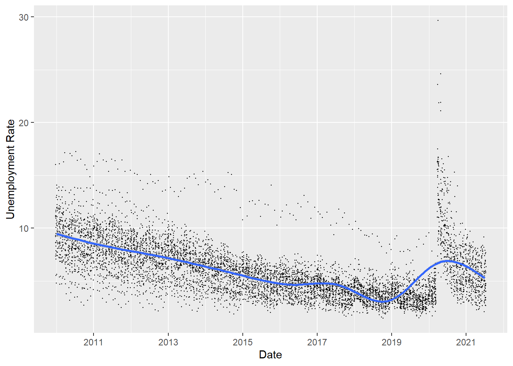

```{r setup, include=FALSE}
knitr::opts_chunk$set(echo = TRUE)
```

Hi, my name is Troy Ascher. I'm currently doing a master's degree from in Computer Information Systems with a Business Intelligence and Database Management specialization at Boston University. I'll graduate in May of 2022 and I'm looking for a challenging and interesting job that involves data analysis and business intelligence. To assist employers with evaluating my skill-set I've built this website. Welcome!

On this page I've highlighted some visualizations that I've done in RStudio. You can click on the images to view the projects they are from, or use the menu at the top of the page to navigate.

[](Unemployment_API_Notebook.html)

This website was generated using RMarkdown in RStudio and Github for web hosting.
